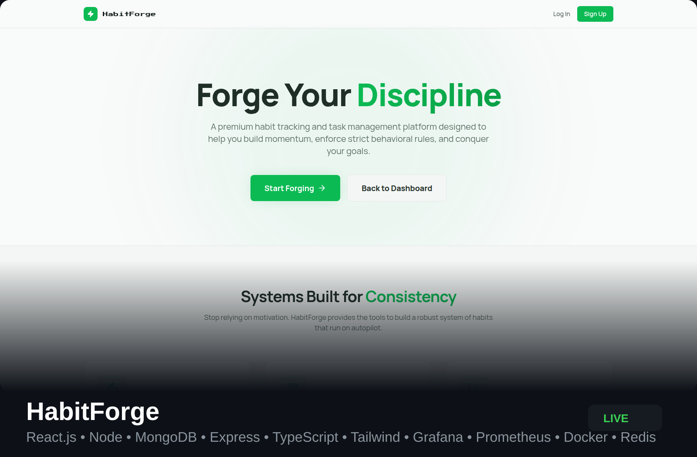

<h1 align="center">Sujay Arun Panda 👨🏽‍💻  </h1>
<br /> 
<p align="center">
<a href="https://www.linkedin.com/in/sujay-panda-a349a3206/">

</a>
</p>

<p align="center">Full-stack developer building modern web applications with React, Node.js, and MongoDB. I enjoy creating clean user experiences while designing reliable back-end systems. Currently exploring DevOps, distributed systems, and high-performance architectures.
</p>

<h2 align="center">⚡ Tech Stack</h2>
<p align="center">  </p>
<h2 align="center">🚀 Featured Projects</h2>
<p align="center"> <a href="https://github.com/Sujayz22/HabitForge">  </a> &nbsp
<a href="https://github.com/Sujayz22/CosmicArchStudioWeb"> </a>
</p>

<h2 align="center">🚀 Featured Deployments</h2>

<p align="center">
  <a href="https://habit-forge.app">
    
  </a>

  <a href="https://cosmicarchstudio.in">
    
  </a>
</p>

<h2 align="center">📊 GitHub Activity</h2>
<p align="center">

</p>

<h2 align="center">⏱️ Dev Metrics</h2>
<!--START_SECTION:waka-->

```txt
From: 03 March 2026 - To: 04 April 2026

Total Time: 11 hrs 19 mins

JavaScript   3 hrs 38 mins         ████████░░░░░░░░░░░░░░░░░   32.14 %
TypeScript   2 hrs 19 mins         █████░░░░░░░░░░░░░░░░░░░░   20.52 %
Markdown     1 hr 39 mins          ███▓░░░░░░░░░░░░░░░░░░░░░   14.69 %
Java         1 hr 35 mins          ███▓░░░░░░░░░░░░░░░░░░░░░   14.04 %
Bash         44 mins               █▓░░░░░░░░░░░░░░░░░░░░░░░   06.52 %
Docker       12 mins               ▒░░░░░░░░░░░░░░░░░░░░░░░░   01.85 %
```

<!--END_SECTION:waka-->
<h2 align="center">🔥 Contribution Streak</h2>
<p align="center">  </p>

<h2 align="center">🔥 HeatMap</h2>
<p align="center">

</p>